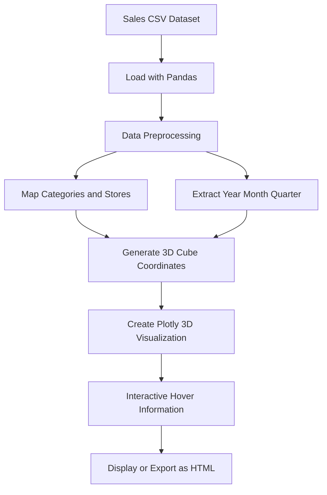

# Interactive 3D Sales Data Visualization

Interactive 3D visualization of transactional sales data using **Python and Plotly**. Each transaction is represented as a 3D cube, with product categories distinguished by color and transaction details available through hover information.

## Visualizations

The project provides three views of the sales data:

* **Store × Year × Product Category**
* **Year × Month × Product Category**
* **Year × Quarter × Product Category**

## Workflow



## Technologies

* **Python**
* **Pandas**
* **Plotly**
* **NumPy**
* **Matplotlib**
* **Google Colab**

## Dataset

The visualization uses a `sales_data.csv` dataset containing transaction information such as:

* `date`
* `store_id`
* `product_category`

## Kaggle Notebook

The complete implementation is available on Kaggle:

**[View Kaggle Notebook](https://www.kaggle.com/code/mirabuhuraira/interactive-3d-sales-data-visualization)**

## Project Structure

```text
Interactive-3D-Sales-Visualization/
├── README.md
└── 3d_sales_visualization.ipynb
```

## Output

The Plotly visualizations can be explored interactively in the notebook and exported as standalone HTML files.

## Future Improvements

* Interactive filters for stores and categories
* Sales-based cube sizing
* Time-based animation
* Additional sales statistics
* Web-based dashboard deployment
